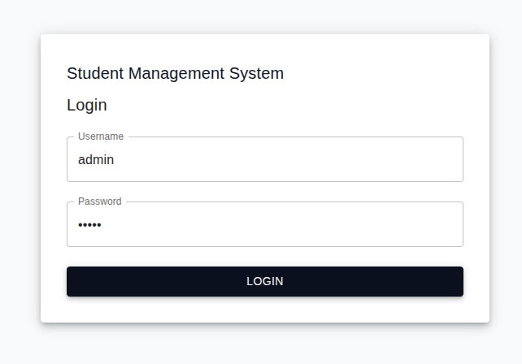
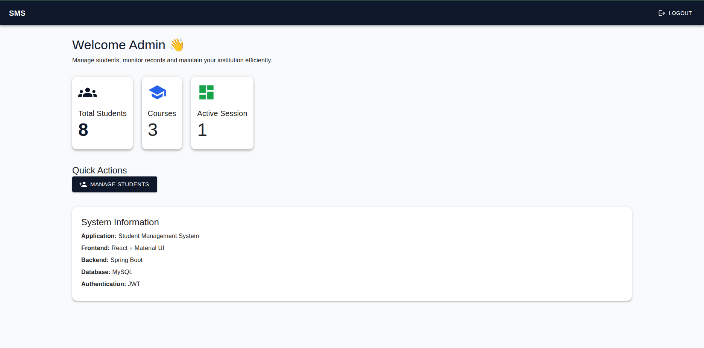
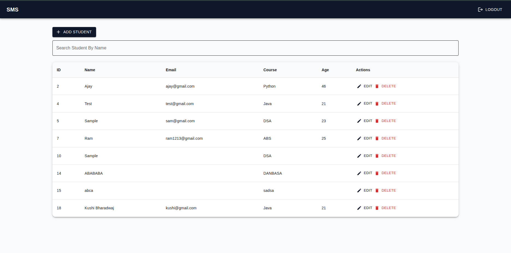
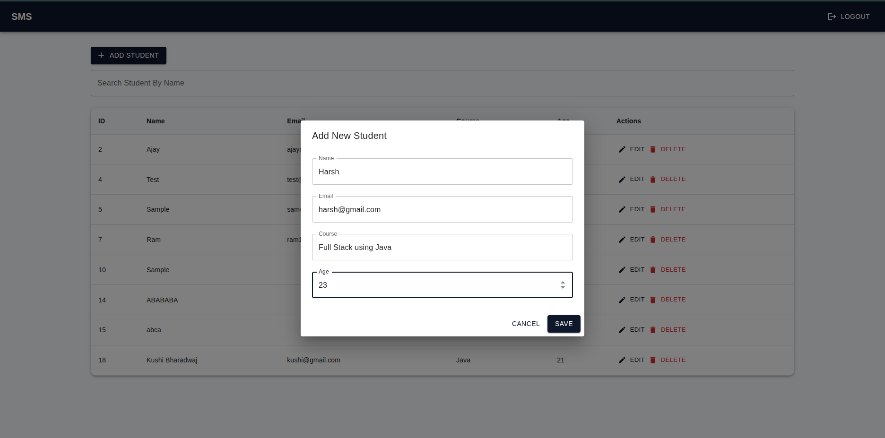
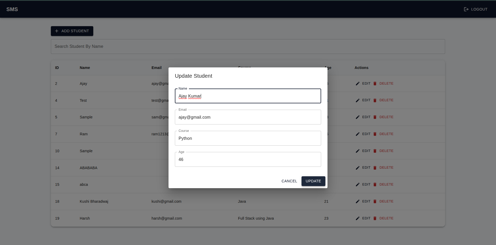
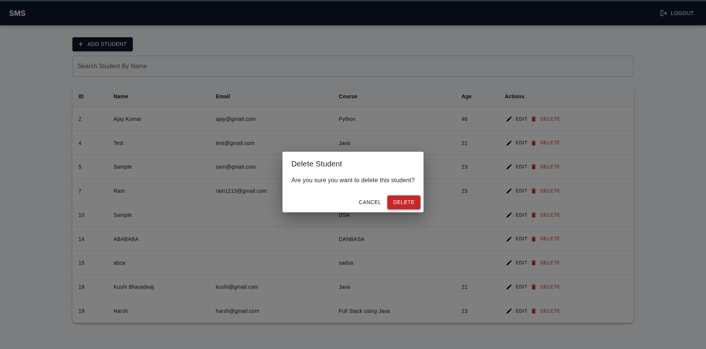

# Student Management System

A Full Stack Student Management System built using **React**, **Material UI**, **Spring Boot**, **Spring Security**, **JWT**, **JPA**, and **MySQL**.

## Screenshots

### Login Page



### Dashboard



### Students Management



### Add Student Dialog



### Edit Student Dialog



### Delete Confirmation



---

# Features

## Authentication

- Admin Login
- JWT Authentication
- Protected Routes
- Logout

---

## Dashboard

- Total Students Count
- Quick Actions
- System Information
- Responsive Material UI Design

---

## Student Management

- View Students
- Add Student
- Update Student
- Delete Student
- Search Student

---

## Security

- Spring Security
- JWT Token Generation
- JWT Token Validation
- Protected APIs

---

# Tech Stack

## Frontend

- React
- React Router DOM
- Axios
- Material UI
- Material Icons

---

## Backend

- Java
- Spring Boot
- Spring Security
- Spring Data JPA
- JWT
- MySQL

---

# Project Structure

## Backend

```text
src/main/java/com/sms

├── controller
│   ├── AuthController
│   └── StudentController
│
├── service
│   ├── JwtService
│   └── StudentService
│
├── repository
│   └── StudentRepository
│
├── model
│   └── Student
│
├── dto
│   ├── LoginRequestDTO
│   ├── StudentRequestDTO
│   └── StudentResponseDTO
│
├── config
│   ├── SecurityConfig
│   └── JwtFilter
│
├── exception
│   ├── StudentNotFoundException
│   └── GlobalExceptionHandler
│
└── SmsApplication
```

---

## Frontend

```text
src

├── pages
│   ├── Login.jsx
│   ├── Dashboard.jsx
│   ├── Students.jsx
│
├── components
│   └── Navbar.jsx
│
├── context
│   └── AuthContext.jsx
│
├── services
│   └── studentService.js
│
├── routes
│   └── AppRoutes.jsx
│
├── App.jsx
└── main.jsx
```

---

# Database

## students

| Column | Type    |
| ------ | ------- |
| id     | INT     |
| name   | VARCHAR |
| email  | VARCHAR |
| course | VARCHAR |
| age    | INT     |

---

# Backend Dependencies

## Maven Dependencies

```xml
<dependencies>
		<dependency>
			<groupId>org.springframework.boot</groupId>
			<artifactId>spring-boot-starter-webmvc</artifactId>
		</dependency>

		<dependency>
			<groupId>org.springframework.boot</groupId>
			<artifactId>spring-boot-starter-webmvc-test</artifactId>
			<scope>test</scope>
		</dependency>

		<dependency>
			<groupId>com.mysql</groupId>
			<artifactId>mysql-connector-j</artifactId>
		</dependency>

		<dependency>
			<groupId>org.springframework.boot</groupId>
			<artifactId>spring-boot-starter-jdbc</artifactId>
		</dependency>

		<dependency>
			<groupId>org.springframework.boot</groupId>
			<artifactId>spring-boot-starter-data-jpa</artifactId>
		</dependency>

		<dependency>
			<groupId>org.springframework.boot</groupId>
			<artifactId>spring-boot-starter-security</artifactId>
		</dependency>

		<dependency>
			<groupId>io.jsonwebtoken</groupId>
			<artifactId>jjwt-api</artifactId>
			<version>0.12.5</version>
		</dependency>

		<dependency>
			<groupId>io.jsonwebtoken</groupId>
			<artifactId>jjwt-impl</artifactId>
			<version>0.12.5</version>
			<scope>runtime</scope>
		</dependency>

		<dependency>
			<groupId>io.jsonwebtoken</groupId>
			<artifactId>jjwt-jackson</artifactId>
			<version>0.12.5</version>
			<scope>runtime</scope>
		</dependency>

		<dependency>
			<groupId>org.springframework.boot</groupId>
			<artifactId>spring-boot-starter-oauth2-client</artifactId>
		</dependency>
	</dependencies>
```

---

# Frontend Dependencies

Install:

```bash
npm install axios
npm install react-router-dom
npm install @mui/material
npm install @emotion/react
npm install @emotion/styled
npm install @mui/icons-material
```

---

# MySQL Configuration

## application.properties

```properties
spring.datasource.url=jdbc:mysql://localhost:3306/student_management
spring.datasource.username=root
spring.datasource.password=root
spring.jpa.hibernate.ddl-auto=update
spring.jpa.show-sql=true
jwt.secret=mySecretKeyForStudentManagementSystem123456
```

---

# API Endpoints

## Authentication

### Login

```http
POST /auth/login
```

Request

```json
{
  "username": "admin",
  "password": "admin"
}
```

Response

```json
JWT_TOKEN
```

---

## Students

### Get All Students

```http
GET /students
```

---

### Get Student By ID

```http
GET /students/{id}
```

---

### Add Student

```http
POST /students
```

```json
{
  "name": "Tushar",
  "email": "tushar@gmail.com",
  "course": "MCA",
  "age": 22
}
```

---

### Update Student

```http
PUT /students/{id}
```

---

### Delete Student

```http
DELETE /students/{id}
```

---

### Search Student

```http
GET /students/search?name=tush
```

---

### Student Count

```http
GET /students/count
```

---

# Run Backend

```bash
mvn clean install
mvn spring-boot:run
```

Backend runs on:

```text
http://localhost:8080
```

---

# Run Frontend

```bash
npm install
npm run dev
```

Frontend runs on:

```text
http://localhost:5173
```

---

# Screens

- Login Page
- Dashboard
- Student Management
- Add Student Dialog
- Update Student Dialog
- Delete Confirmation Dialog

---

# Learning Outcomes

- React Fundamentals
- Context API
- React Router
- Axios
- Material UI
- Spring Boot
- Spring Security
- JWT Authentication
- REST APIs
- Spring Data JPA
- MySQL Integration
- Full Stack Development

---

# Author

Tushar Haryana
Built for Full Stack Development Learning and Practice.
